# VerdureAI

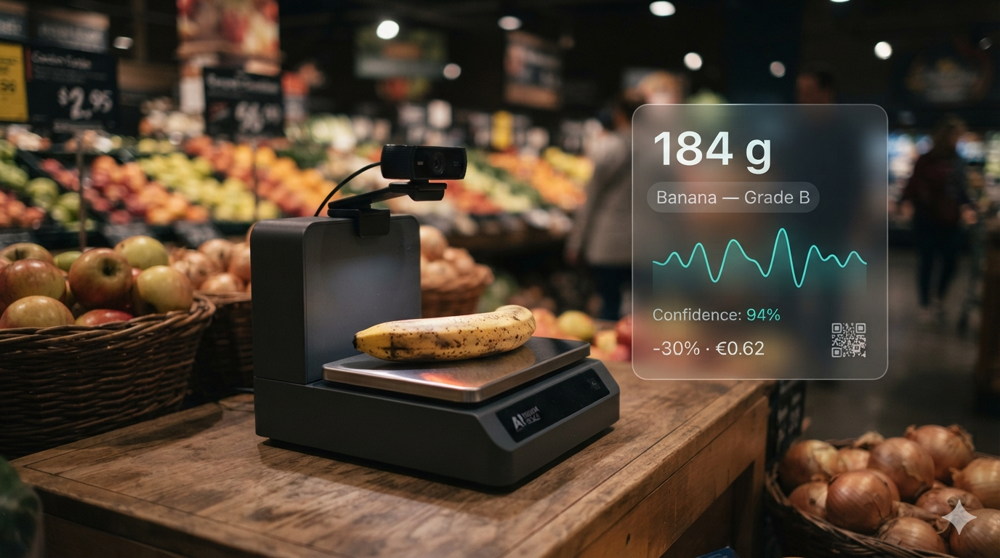

An edge-AI checkout scale that grades fresh produce and reads packaged-goods expiry dates
at the point of sale, applying a proportional discount to items that are still good to eat
but wouldn't otherwise sell, built on the Arduino UNO Q for the
[Invent the Future with Arduino UNO Q and App Lab](https://www.hackster.io/contests/invent-the-future-with-arduino-uno-q-and-app-lab)
contest.

## Problem

I noticed there was a lot of good food quietly going to waste at my local grocery store:
apples pulled from the shelf for a bruise no bigger than a thumbprint, yoghurt binned the same
day its best-by date hit even though it's usually still perfectly fine well past that. It was
easy to write off as one shop being overcautious, so I went looking for the numbers, and it
turns out to be a much bigger problem than a single store's habits.

Roughly a third of all food produced for human consumption is never eaten. The FAO puts
post-harvest loss before food even reaches a shop at 13.2% of global production, with
another 19% wasted at the retail, food-service and household stages on top of that
([FAO Food Loss and Food Waste Policy Series](https://www.fao.org/policy-support/policy-themes/food-loss-and-food-waste/fao-policy-series--food-loss---food-waste)).
The UN Environment Programme's [Food Waste Index Report 2024](https://www.unep.org/resources/publication/food-waste-index-report-2024)
puts a number on the 2022 total: 1.05 billion tonnes of food wasted at retail, food-service
and household level combined, of which 12% (131 million tonnes) came from retail. Globally,
food loss and waste accounts for an estimated 8-10% of all greenhouse gas emissions, more than the
aviation and shipping industries combined.

It isn't just a global-average problem, either. [Eurostat's 2023 figures](https://ec.europa.eu/eurostat/web/products-eurostat-news/w/ddn-20251016-2)
put EU food waste at 58.2 million tonnes a year (130 kg per person), with a market value of
€132 billion. Retail and distribution alone account for 8% of that.

What struck me most is how much of what gets thrown away was never actually spoiled: it was
rejected for how it looks. A [study reported by The Conversation, citing UK Parliament data](https://theconversation.com/how-ugly-fruit-and-vegetables-could-tackle-food-waste-and-solve-supermarket-supply-shortages-201216),
found that as much as 25% of apples, 20% of onions and 13% of potatoes grown are discarded
purely because they don't look right, even though the same research found 87% of shoppers
say they'd happily buy "wonky" fruit and vegetables if given the option and the price
reflected it. The demand for imperfect produce already exists; what's missing is a fast,
objective, in-store way to grade it and price it accordingly instead of pulling it before it
ever reaches a shelf. When I asked staff at a couple of local grocery stores how they actually
handle ageing produce and near-date packaged goods, what they described matched this published
research almost exactly: cosmetic imperfections and approaching best-by dates drive markdowns
and disposal decisions well before the food is actually inedible.

That's the gap I built VerdureAI to close, at the one point in the chain where a decision gets
made item-by-item, in real time: the checkout scale.

## Solution

I built VerdureAI to replace that moment (a shopper weighing loose produce or scanning a
packaged item) with a smart checkout scale that decides, on the spot, whether that item
deserves a discount. It comes down to three steps:

**1. Set it down.** An item placed on the scale is read continuously by a load cell until
the reading settles, the same way it would be on any digital kitchen or produce scale.

**2. It looks it over.** Once the weight is stable, a camera captures the item and checks it
for a barcode or QR code. A code means packaged goods: identified against the Open Food Facts
database, with its printed best-by date read straight off the packaging by optical character
recognition. No code means loose produce: classified in a single pass by a neural network
trained to recognise both the type of produce and its condition (bruising, soft spots,
overripeness), entirely on-device.

**3. Get a fair price.** A grade-A apple or a can with months of shelf life left prices at
full value. A blemished banana or a yoghurt three days from its best-by date is discounted
proportionally. An item too far gone to sell safely is flagged and pulled rather than priced
at all. The result appears immediately on the kiosk screen: the item, the basis for its
price, and a QR code the shopper scans at checkout to redeem it.

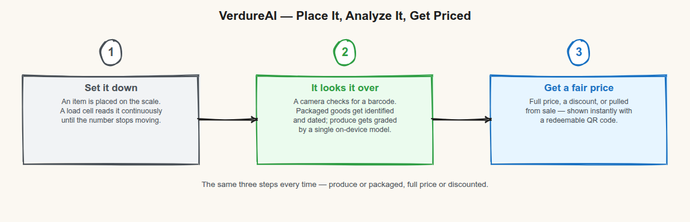

All of this runs locally on the board. No image or weight ever leaves the device to make a
pricing decision. The only network call in the whole pipeline is a barcode-to-product
lookup against the public Open Food Facts API, and even that is cached locally so a repeat
scan works offline.

**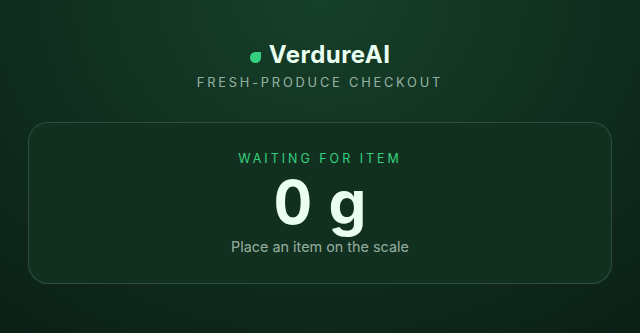**
*Kiosk screen at rest, waiting for an item to be placed on the scale.*

**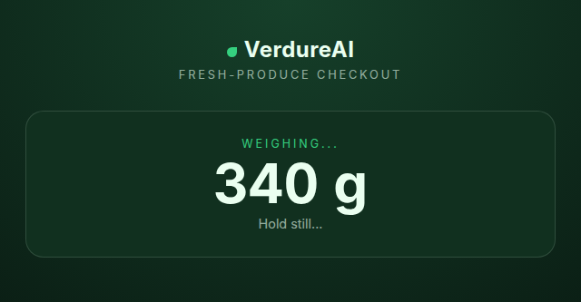**
*An item has been placed and the reading is still settling.*

**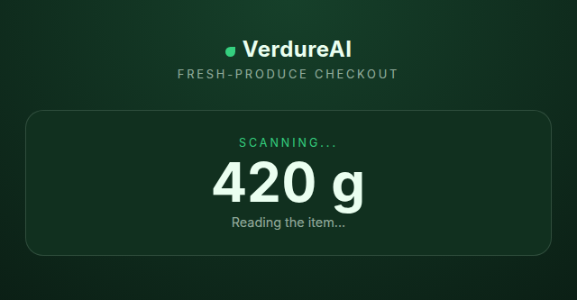**
*Weight has stabilised; the camera is capturing and classifying the item.*

**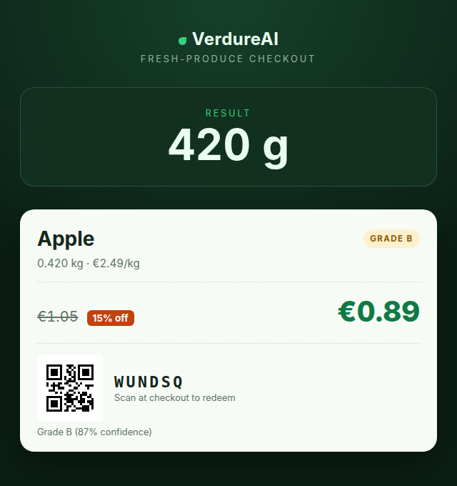**
*A Grade B apple, priced by weight with a proportional discount and a redeemable QR code.*

**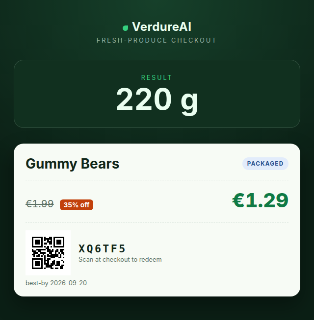**
*A packaged item identified by barcode, discounted against its printed best-by date.*

**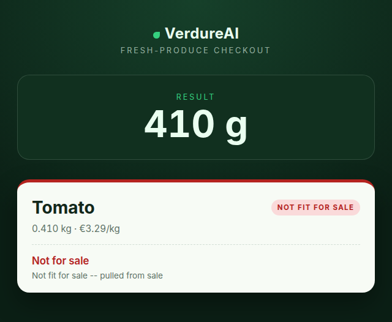**
*An item graded past the point of sale is pulled rather than priced.*

## Hardware Breakdown

| Qty | Component                                                                                               | Approx. price | Role                                                                      | Why this choice                                                                                                                                                                                                             |
| --- | ------------------------------------------------------------------------------------------------------- | ------------- | ------------------------------------------------------------------------- | --------------------------------------------------------------------------------------------------------------------------------------------------------------------------------------------------------------------------- |
| 1   | [Arduino UNO Q](https://store.arduino.cc/products/uno-q)                                                | €55           | Dual-brain controller: STM32U585 MCU + Qualcomm QRB2210 MPU running Linux | The MCU handles real-time load-cell sampling while the MPU runs the camera pipeline, the ML models, and the web UI: one board, no separate SBC-plus-microcontroller wiring                                                  |
| 1   | [Adafruit NAU7802](https://www.adafruit.com/product/4538) 24-bit ADC breakout                           | €7            | Reads the load cell over I²C                                              | Purpose-built for low-level strain-gauge signals, with on-chip gain/offset calibration so the MCU doesn't need its own amplifier front-end                                                                                  |
| 1   | [1 kg straight-bar strain-gauge load cell](https://www.sparkfun.com/products/13329) + weighing platform | €10-15        | The physical scale                                                        | 1 kg headroom comfortably covers a single piece of fruit or a packaged item while keeping better resolution at the low end than a multi-kilogram cell would                                                                 |
| 1   | 1080p USB webcam (UVC-class)                                                                            | €15-25        | Captures the item for barcode/QR detection and produce classification     | USB video is natively supported by the MPU's Linux side (`arduino.app_peripherals.camera`), needs no custom driver, and 1080p is comfortably enough resolution for both barcode reads and close-up produce condition detail |
| 1   | HDMI display (any monitor, or a compact kiosk panel)                                                    | €0-100        | Renders the kiosk screen                                                  | Drives the on-screen price label directly from the MPU's own desktop output, no separate display controller                                                                                                                 |
| 1   | USB-C PSU, 5 V / 3 A                                                                                    | €10           | Powers the UNO Q                                                          | Matches the board's rated input; an underpowered supply is the most common cause of MPU brownouts on Linux-capable boards                                                                                                   |
| n/a | Jumper wires (M-F, 4×) + a small enclosure or base plate                                                | €5            | Wiring + mechanical mounting                                              | Keeps the load cell rigidly fixed under the platform, which matters for repeatable zero-offset calibration                                                                                                                  |

**Total: roughly €100-120**, all in widely-stocked, off-the-shelf parts, and no custom PCB or
3D-printed part is required to reproduce this build.

Any UVC-compliant USB webcam and any load cell + HX711/NAU7802-style ADC combination this
board's I²C bus can drive should work as drop-in substitutes; the code depends on the
`arduino.app_peripherals.camera` and Bridge-exposed weight/stability interfaces, not a
specific part number.

**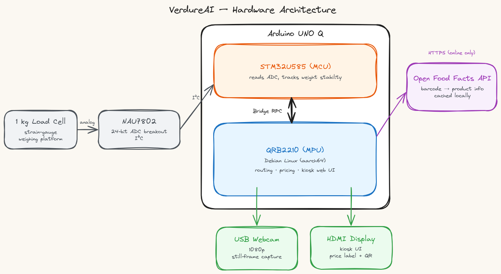**
*Block-level view of the two processors, the sensing/vision peripherals, and the one
external network dependency.*

**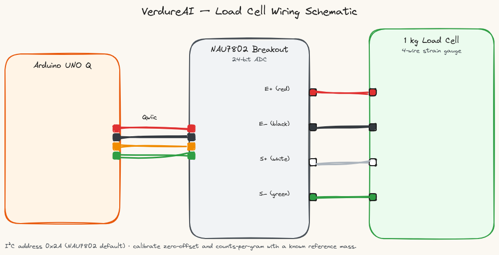**
*Pin-level wiring from the load cell through the NAU7802 ADC to the UNO Q's I²C header.*

## Software Architecture

VerdureAI is one continuous decision loop, split across the UNO Q's two processors the way
[Arduino App Lab](https://docs.arduino.cc/software/app-lab/) expects: a real-time processor
handles the physical sensing, and a Linux-side processor handles everything that needs vision,
a model, or a network call.

**Sensing.** The real-time side samples the load cell continuously and only reports a weight
once it has settled: an item still being placed, or a hand still resting on the scale, never
triggers a reading. That settled weight is the single event the rest of the pipeline waits on.

**Capture and routing.** The moment the weight stabilises, a camera captures one frame of the
item and the system checks it for a barcode or QR code. That single check is the fork in the
pipeline: a code present means packaged goods, no code means loose produce, and everything
downstream depends on which branch was taken.

**Understanding the item.** Loose produce goes to an on-device image classifier trained to
recognise both what the produce is and its condition (bruising, soft spots, overripeness)
in a single pass, so it never needs to know the type before it can judge the condition.
Packaged goods take a different path: the barcode identifies the product against a public
product database, and a scene-text reader looks for a printed best-by date directly on the
captured frame, the same way a person would glance at the label.

**Pricing and disposition.** Whatever the item turned out to be, its condition or expiry
maps to one of three outcomes: full price, a proportional discount, or (for produce judged
unsellable or packaging that's already expired) pulled from sale rather than priced at all.
A discount always comes with a redeemable code and QR, generated fresh for that item.

**Presentation.** The result is pushed to a kiosk screen the instant it's ready (a live
push over a socket connection, not a page the shopper has to refresh), showing the item, the
basis for its price, and the QR code to redeem it.

Everything above runs entirely on the board. The only network call anywhere in the pipeline
is the packaged-goods product lookup, and even that is cached locally so a repeat or offline
scan still resolves.

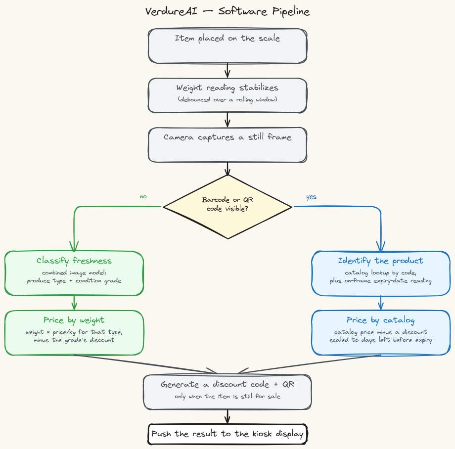

**Produce classifier: labeling scheme and examples.** The freshness classifier is one
combined image model, not one model per produce type and not a separate freshness detector
bolted onto a type detector. Every training image is labeled
`<type>_<grade>` (`apple_gradeA`, `banana_gradeC`, `tomato_reject`, and so on), so a single
forward pass tells the pipeline both what the item is and whether it's still sellable. Grades
run gradeA (fresh) → gradeB → gradeC (increasing discount) → reject (pulled from sale).

| Image                                                                        | Intended label                             | Why                                                                                                                                                                                                                                                      |
| ---------------------------------------------------------------------------- | ------------------------------------------ | -------------------------------------------------------------------------------------------------------------------------------------------------------------------------------------------------------------------------------------------------------- |
| 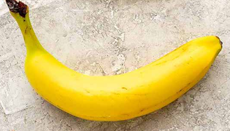 | `banana_gradeA`                            | Uniform colour, no spotting or bruising: full price.                                                                                                                                                                                                     |
| 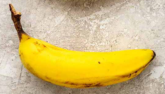            | `banana_gradeB`                            | Sugar-spotting has just started but the fruit is fully sound: a small discount.                                                                                                                                                                          |
| 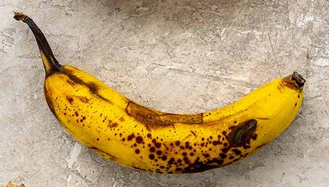            | `banana_gradeC`                            | Dense spotting over most of the peel, still edible, but a steep discount to move it before it turns.                                                                                                                                                     |
| 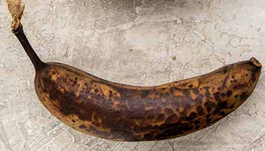       | `banana_reject`                            | Skin has broken down past the point most shoppers would buy it: pulled from sale.                                                                                                                                                                        |
| 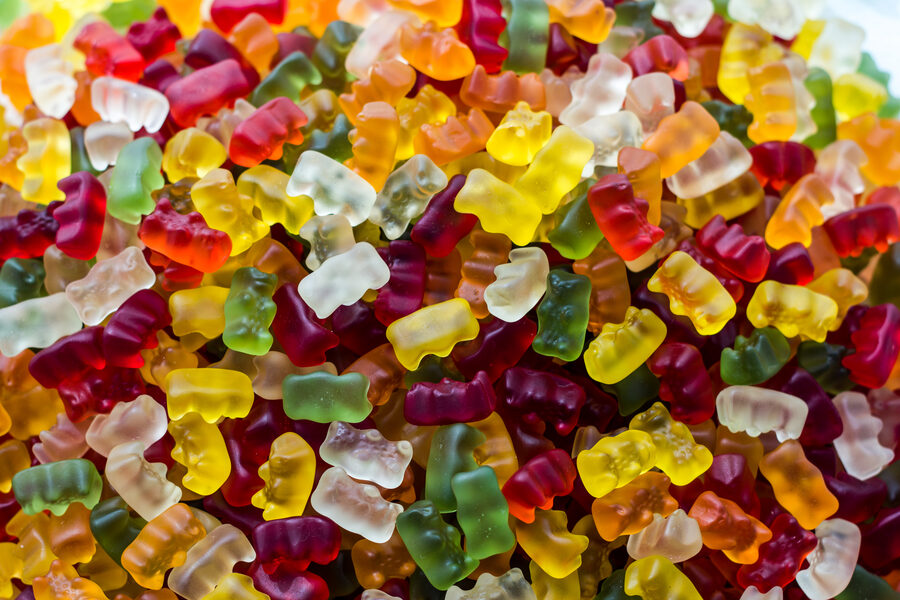                         | *(none of the above, out-of-distribution)* | A deliberately out-of-scope input. Below `PRODUCE_MIN_CONFIDENCE`, or not matching any trained label, the classifier is designed to say "unrecognised" rather than force a guess: a bowl of candy should never be quietly weighed and priced as produce. |

## Deployment

1. **Set up App Lab on the UNO Q.** Follow Arduino's
   [App Lab getting-started guide](https://docs.arduino.cc/software/app-lab/tutorials/getting-started/)
   to get the board flashed and `arduino-app-cli` running.
2. **Clone this repo directly onto the board**, in place of an empty scaffolded app:
   ```bash
   ssh <board-host>
   git clone https://github.com/<your-fork>/verdure-ai.git ~/ArduinoApps/verdureai
   ```
   App Lab's daemon watches `~/ArduinoApps/<app>` for changes and rebuilds automatically, so
   a later `git pull` in that directory picks up any update without a separate deploy step.
3. **Get the produce classifier onto the board.** Arduino App Lab (0.5.0+) has a direct Edge
   Impulse integration built for exactly this brick, so a model never has to be manually
   copied onto the board. The fastest path is to clone the project I already trained:
   1. Open [this Edge Impulse project](https://studio.edgeimpulse.com/studio/1112467) and use
      the clone button next to the project name to copy it into your own Edge Impulse
      account, then continue from step 6 below.

   If you'd rather expand the dataset yourself, for example to add produce types or more
   images, start from step 1 instead:
   1. In [Edge Impulse Studio](https://studio.edgeimpulse.com/), create a project and open
      **Data acquisition**. Collect (or upload) images for each produce type across each
      condition grade; the more lighting/angle variety per class, the better it generalises.
   2. Label every image with the combined `<type>_<grade>` scheme this repo's
      `config.py`/`produce_classifier.py` expect: `apple_gradeA`, `apple_gradeB`,
      `apple_gradeC`, `apple_reject`, and the same four grades for every other produce type
      you want recognised.
   3. Under **Impulse Design → Create impulse**, add an **Images** processing block and a
      **Transfer Learning (Images)** learning block, then **Save impulse**.
   4. Open the **Images** block, confirm colour depth (RGB), **Save parameters**, then
      **Generate features** and check the feature explorer for classes that cleanly separate.
   5. Open the **Transfer Learning** block, set training cycles/learning rate (defaults are a
      reasonable start), leave data augmentation on for a small dataset, and **Start
      training**. Check **Model testing** afterwards: a test accuracy well below training
      accuracy means more data, not more epochs.
   6. Go to **Deployment**, select **UNO Q** as the deployment target, and click **Build**.
   7. Click **Go to Arduino** from the completed build. In App Lab, open this app, click the
      `arduino:image_classification` brick on the block canvas, open its **AI models** tab,
      and **Download** the model that build just produced.
   8. Open **Brick Configuration** on that same brick, select the downloaded model, and
      **Save**. App Lab writes the reference into `app.yaml` for you.

4. **Calibrate the load cell.** `sketch/sketch.ino`'s `COUNTS_PER_GRAM` and
   `ZERO_OFFSET_COUNTS` constants are placeholders. With nothing on the scale, read the raw
   ADC value and set `ZERO_OFFSET_COUNTS` to it; with a known weight on the scale, solve for
   `COUNTS_PER_GRAM` from the difference.
5. **Start the app:**
   ```bash
   arduino-app-cli app restart user:verdureai
   arduino-app-cli app logs user:verdureai   # confirm the sketch built and Python started
   ```
6. **Open the kiosk screen** at the URL the `web_ui` brick logs on startup, on the board's
   own HDMI display or any browser on the same network.

## Challenges

**Getting the load-cell mount right.** The load cell has to sit dead level under the
weighing platform for the NAU7802's zero-offset calibration to hold, and the platform itself
has to lift cleanly off the load cell when an item is placed rather than binding against a
fixed frame around it. I designed a small 3D-printed housing to hold the load cell and hinge
the platform above it, and getting that hinge right took several print iterations: too little
clearance and the platform dragged against the housing partway down, throwing off every
reading; too much and the platform rocked instead of resting flat on the load cell's contact
point. It took a few rounds of reprinting the hinge boss at slightly different tolerances
before the platform sat flat and moved freely at the same time.

**Building a dataset that didn't exist.** None of the public produce datasets I found matched
what I actually needed: a single combined label per image, covering both the produce type and
a graded condition scale (`gradeA` through `reject`), not just a binary fresh/rotten split.
[Fruits-360](https://www.kaggle.com/datasets/moltean/fruits) has excellent type coverage but
is entirely fresh, studio-lit fruit on a turntable, with no spoiled examples at all. Several
Kaggle sets built for freshness (e.g. `sriramr/fruits-fresh-and-rotten-for-classification`,
`raghavrpotdar/fresh-and-stale-images-of-fruits-and-vegetables`) had rotten examples, but only
a fresh/rotten split rather than a graded scale. A banana-specific dataset,
[BananaImageBD](https://www.sciencedirect.com/science/article/pii/S2352340924012010), came
closest with four labeled ripeness stages, but only for one fruit. I ended up building my own
training set: pulling images from several of these, relabeling and filtering them into the
`<type>_<grade>` scheme (dropping anything that didn't clearly represent one grade, and
checking that "rotten" in one dataset's sense actually meant `reject` rather than a milder
`gradeC` in mine), and taking my own photos to fill in the gaps, especially the middle
grades, which datasets built around a fresh/rotten split skip over entirely.

## Limitations

- **Lighting and camera angle affect both pipelines.** The produce classifier and the OCR
  step both work from a single overhead frame; harsh shadows, reflections off packaging, or
  an item presented at a steep angle can degrade a reading the same way they would for a
  human cashier glancing at an item.
- **The model only knows what it was trained on.** A produce type outside the training set
  is either misclassified or, below the confidence threshold, rejected outright and the
  shopper is asked to re-place the item, a deliberate choice to avoid guessing a price, but
  it does mean coverage is bounded by how much training data exists per produce type.
  Similarly, OCR on best-by dates depends on print quality and placement; a smudged,
  low-contrast, or unusually formatted date can go unread, in which case the item is priced
  at full value rather than penalised for a date the system genuinely can't see.
- **It's a classifier, not a counter.** The produce model assumes one item per frame. If
  someone places two different fruits together, or two pieces of the same fruit at different
  grades, it still returns a single label for the whole frame, so the price it produces can be
  wrong for a mixed placement. The kiosk currently relies on the shopper weighing items one at
  a time, the same convention as a standard produce scale, rather than detecting and rejecting
  multi-item frames itself.

## Next Steps

- **Pilot in a single store section.** Run VerdureAI alongside a store's existing produce
  scale for a trial period, comparing its markdown decisions against staff judgement to
  validate accuracy before wider rollout.
- **Feed distribution centres, not just checkouts.** The same classification pipeline could
  run further upstream, at a warehouse receiving dock, to sort and route produce by
  remaining shelf-life before it ever reaches a store shelf.
- **Aggregate freshness data across a chain.** Anonymised grading data collected across many
  stores could help a retailer identify which suppliers, farms, or transport routes
  consistently deliver produce that keeps longer, turning a per-item pricing tool into a
  supply-chain quality signal.
- **Bring it into the home.** A miniaturised version of the same pipeline (camera plus small
  scale) could help households track their own produce and packaged goods, nudging toward
  using older items first instead of letting them spoil unnoticed in a fridge.
- **Real POS integration.** Replace the demo pricing table and in-memory discount registry
  with a live connection to a store's actual point-of-sale system, so a scanned QR code
  applies the discount automatically at checkout rather than needing a cashier to key it in.
